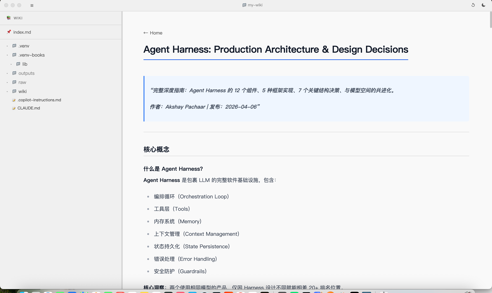

# Wiki Viewer

[English](#english) | [中文](#中文)

---

<a id="english"></a>

## English

A lightweight desktop app for browsing and reading a local folder of Markdown files.  
Built with Electron, React, and TypeScript.





---

### Features

- **File tree sidebar** — automatically scans your wiki folder and displays all `.md`, `.txt`, and `.pdf` files in a navigable tree
- **Full Markdown rendering** — powered by `react-markdown` with these extras:
  - GitHub Flavored Markdown (tables, strikethrough, task lists, etc.)
  - Syntax-highlighted code blocks via `highlight.js`
  - Math equations via **KaTeX** (`$inline$` and `$$block$$`)
  - **Mermaid** diagrams (flowcharts, sequence diagrams, etc.)
  - Raw HTML passthrough
- **Wiki-style links** — `[[Page Name]]` and `[[Page Name|alias]]` syntax supported
- **Relative image resolution** — images referenced with relative paths are resolved against the source file's location
- **Front-matter support** — YAML front-matter is stripped before rendering (via `gray-matter`)
- **Dark / Light theme** — toggle with one click, preference is persisted
- **Resizable & collapsible sidebar** — drag to resize or collapse entirely, width is remembered
- **Pinned home file** — `wiki/index.md` opens automatically on launch
- **Configurable wiki root** — select any folder via the UI; the setting is saved across sessions
- **External links** open in the system default browser

---

### Tech Stack

| Layer             | Libraries                                                                           |
| ----------------- | ----------------------------------------------------------------------------------- |
| Desktop shell     | Electron 35                                                                         |
| Build tooling     | electron-vite, Vite                                                                 |
| UI framework      | React 18, TypeScript                                                                |
| Styling           | Tailwind CSS v4                                                                     |
| Markdown          | react-markdown, remark-gfm, remark-math, rehype-highlight, rehype-katex, rehype-raw |
| Diagrams          | Mermaid                                                                             |
| Math              | KaTeX                                                                               |
| Code highlighting | highlight.js                                                                        |
| Front-matter      | gray-matter                                                                         |

---

### Getting Started

#### Prerequisites

- Node.js ≥ 18
- npm ≥ 9

#### Install dependencies

```bash
npm install
```

#### Run in development mode

```bash
npm run dev
```

#### Build for production

```bash
npm run build
```

#### Package as macOS DMG

```bash
npm run package
```

The output DMG is written to `dist/`.

---

### Project Structure

```
src/
├── main/
│   ├── index.ts          # Electron main process, IPC handlers
│   └── fileSystem.ts     # File tree builder, wiki root config
├── preload/
│   └── index.ts          # Context bridge (exposes wikiAPI to renderer)
├── renderer/
│   ├── App.tsx           # Root component, layout, theme, sidebar resize
│   ├── components/
│   │   ├── Sidebar/      # File tree navigation
│   │   └── Viewer/       # Markdown renderer, code blocks, Mermaid
│   └── styles/
│       └── globals.css
└── shared/
    └── types.ts          # Shared TypeScript types (TreeNode, etc.)
```

---

### Configuration

On first launch the app defaults to `~/work-work/my-wiki` as the wiki root.  
You can change this at any time through the **folder selector** in the UI.  
The chosen path is stored in Electron's `userData` directory as `wiki-viewer-config.json`.

---

### Keyboard & UI Shortcuts

| Action                    | How                                                 |
| ------------------------- | --------------------------------------------------- |
| Collapse / expand sidebar | Click the toggle button at the top of the sidebar   |
| Resize sidebar            | Drag the divider between sidebar and viewer         |
| Switch theme              | Click the sun / moon icon in the header             |
| Change wiki folder        | Click the folder icon in the header                 |
| Navigate to a linked file | Click any internal wiki link                        |
| Open external URL         | Click any `http(s)://` link — opens in your browser |

---

### License

MIT

---

<a id="中文"></a>

## 中文

一款轻量级桌面应用，用于浏览和阅读本地 Markdown 文件夹。  
基于 Electron、React 和 TypeScript 构建。


### 功能特性

- **文件树侧边栏** — 自动扫描 wiki 文件夹，以可导航的树形结构展示所有 `.md`、`.txt` 和 `.pdf` 文件
- **完整 Markdown 渲染** — 基于 `react-markdown`，支持以下扩展：
  - GitHub 风格 Markdown（表格、删除线、任务列表等）
  - `highlight.js` 代码语法高亮
  - **KaTeX** 数学公式（`$行内$` 和 `$$块级$$`）
  - **Mermaid** 图表（流程图、时序图等）
  - 原始 HTML 直通渲染
- **Wiki 风格链接** — 支持 `[[页面名]]` 和 `[[页面名|别名]]` 语法
- **相对路径图片解析** — 图片相对路径基于源文件所在目录进行解析
- **Front-matter 支持** — 渲染前自动剔除 YAML front-matter（通过 `gray-matter`）
- **深色 / 浅色主题** — 一键切换，偏好自动保存
- **可调节 & 可折叠侧边栏** — 拖拽调整宽度或完全折叠，宽度自动记忆
- **固定首页文件** — 启动时自动打开 `wiki/index.md`
- **可配置 wiki 根目录** — 通过界面选择任意文件夹，设置跨会话持久保存
- **外部链接** 在系统默认浏览器中打开

---

### 技术栈

| 层级         | 依赖库                                                                              |
| ------------ | ----------------------------------------------------------------------------------- |
| 桌面外壳     | Electron 35                                                                         |
| 构建工具     | electron-vite, Vite                                                                 |
| UI 框架      | React 18, TypeScript                                                                |
| 样式         | Tailwind CSS v4                                                                     |
| Markdown     | react-markdown, remark-gfm, remark-math, rehype-highlight, rehype-katex, rehype-raw |
| 图表         | Mermaid                                                                             |
| 数学公式     | KaTeX                                                                               |
| 代码高亮     | highlight.js                                                                        |
| Front-matter | gray-matter                                                                         |

---

### 快速开始

#### 前置条件

- Node.js ≥ 18
- npm ≥ 9

#### 安装依赖

```bash
npm install
```

#### 开发模式运行

```bash
npm run dev
```

#### 生产构建

```bash
npm run build
```

#### 打包为 macOS DMG

```bash
npm run package
```

输出的 DMG 文件位于 `dist/` 目录。

---

### 项目结构

```
src/
├── main/
│   ├── index.ts          # Electron 主进程，IPC 处理器
│   └── fileSystem.ts     # 文件树构建，wiki 根目录配置
├── preload/
│   └── index.ts          # Context bridge（向渲染进程暴露 wikiAPI）
├── renderer/
│   ├── App.tsx           # 根组件，布局、主题、侧边栏缩放
│   ├── components/
│   │   ├── Sidebar/      # 文件树导航
│   │   └── Viewer/       # Markdown 渲染器、代码块、Mermaid
│   └── styles/
│       └── globals.css
└── shared/
    └── types.ts          # 共享 TypeScript 类型（TreeNode 等）
```

---

### 配置

首次启动时，应用默认将 `~/work-work/my-wiki` 作为 wiki 根目录。  
可随时通过界面中的**文件夹选择器**更改。  
所选路径以 `wiki-viewer-config.json` 的形式存储在 Electron 的 `userData` 目录中。

---

### 键盘 & 界面快捷操作

| 操作              | 方式                                       |
| ----------------- | ------------------------------------------ |
| 折叠 / 展开侧边栏 | 点击侧边栏顶部的切换按钮                   |
| 调整侧边栏宽度    | 拖拽侧边栏与查看器之间的分隔线             |
| 切换主题          | 点击顶栏中的太阳 / 月亮图标                |
| 更改 wiki 文件夹  | 点击顶栏中的文件夹图标                     |
| 跳转到链接文件    | 点击任意内部 wiki 链接                     |
| 打开外部链接      | 点击任意 `http(s)://` 链接，在浏览器中打开 |

---

### 许可证

MIT
